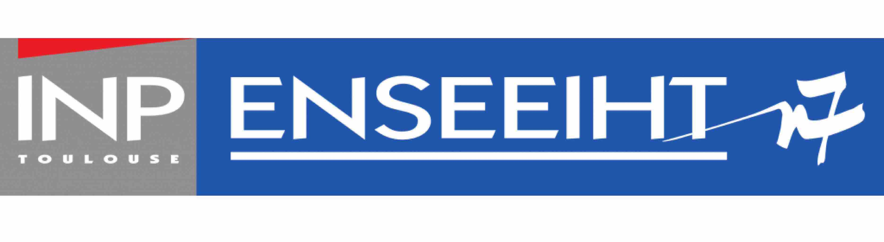

# My official personnal ENSEEIHT repository		

## About :

I'm Faical TOUBALI HADAOUI, an engineering student at Computer Science in ENSEEIHT Toulouse.

*I'm currently in the 2nd year in ENSEEIHT at the field of "Software Engineering" and I am looking for an intership in the domain of artificial intelligence, Machine Learning, Data Science or Software Developpment.*

  

## Connect with me : 

Linkedin :   https://www.linkedin.com/in/faical-toubali-hadaoui/

Gmail    :   faical.toubalihadaoui@gmail.com 

## License :

The library is Open Source Software released under the Apache [License](LICENSE.txt). 
